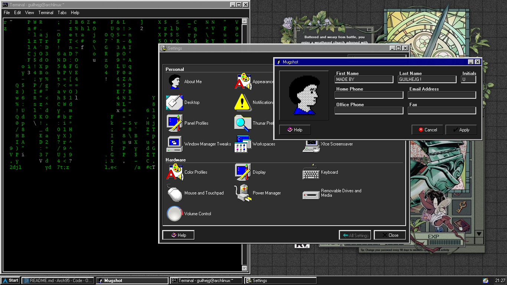

<div align="center">

  

  <h1>Arch95</h1>

  <p>
    <strong>A Windows 95-inspired dark desktop environment for XFCE on Arch Linux.</strong>
  </p>

  <p>
    Built for ThinkPads, retro-computing enthusiasts and minimalists.
  </p>

</div>

# Arch95

### A Windows 95-inspired dark desktop environment for XFCE on Arch Linux.

Built for ThinkPads, retro-computing enthusiasts and people who enjoy simplicity.

</div>

---

## ✨ Features

- 🌙 Windows 95 dark mode aesthetic
- 🎨 Custom Arch95 branding
- 🖥️ Improved Whisker Menu
- 🔔 Win95 Midnight notifications
- 🔊 ThinkPad multimedia integration
- 🎵 PipeWire integration
- 🔤 Helvetica 8 typography
- 🌐 Firefox retro integration

---

## 📂 Structure

```text
Arch95/
├── assets/
├── config/
├── screenshots/
├── scripts/
└── theme/
````

## 🚀 Installation

```bash
mkdir -p ~/.themes

cp -r theme/Arch95 ~/.themes/

cp scripts/arch95-volume ~/.local/bin/

chmod +x ~/.local/bin/arch95-volume
```

Then select **Arch95** in:

`Settings → Appearance → Style`

---

## ❤️ Credits

* Chicago95
* XFCE
* Arch Linux

Arch95 is an independent customization built on top of Chicago95.

## 📜 License

Please preserve the original Chicago95 licenses and attribution when redistributing this project.